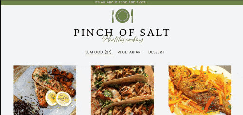

# JavaScript Capstone Project

In this project, we built our own web application based on an external API. The web application has 2 user interfaces:

- On homepage interface you can you can like your favorite meals;
- On comments interface you can add comments;

## Built With

- Java Script
- HTML
- CSS
- Mealdb API

### Technologies used

- Github
- GitFlow
- Visual Studio Code
- webpack
- npm
- jest

[Live demo](https://shoirata.github.io/RecipeApp/)

## Demo

## Getting Started

To get a local copy up and running follow these simple example steps.

- go to the directory that you want to clone the repository in.
- right click and choose Git Bash here.
- type "git clone https://github.com/ShoiraTa/RecipeApp.git".
- run `npm install` to install all the dependencies
- Run `npm start` to bundle the files in the src folder

or

- Go to the dist folder and open index.html

👤 **Shoira Toshpulatova**

- GitHub: [@githubhandle](https://github.com/shoirata)
- LinkedIn: [LinkedIn](https://www.linkedin.com/in/shoira-tashpulatova-bab4a7122/)

👤 **Daniel Shdeed**

- GitHub: [@githubhandle](https://github.com/Danieldotcomcoder))
- LinkedIn: [LinkedIn](https://www.linkedin.com/in/daniel-shdeed-832b03115/)

## Acknowledgments

- Microverse

## 📝 License

This project is [MIT](./MIT) licensed.

## Show your support

Give a ⭐️ if you like this project!
